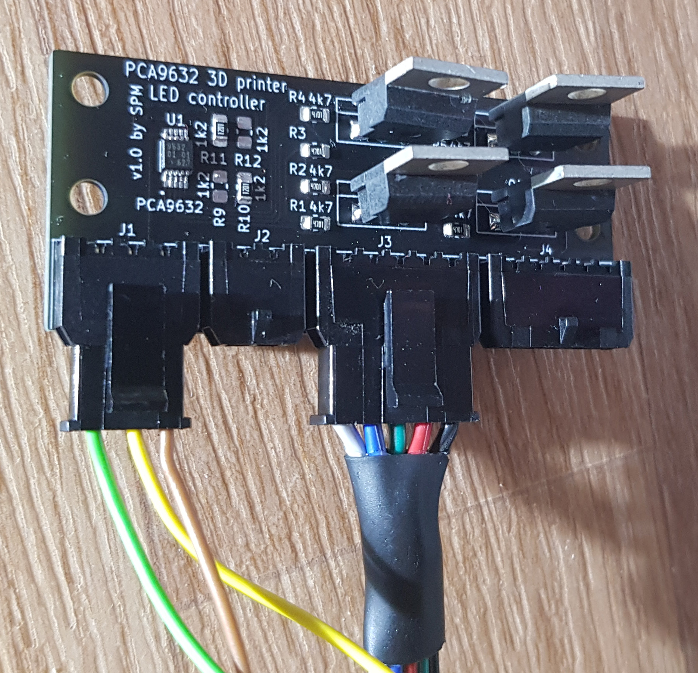

# PCA9632 RGBW LED controller

This project is a PCB design files for RGBW LED controller based on PCA9632 chip. This controller was designed for controlling RGBS LED strips on 3D printer. PCA9632 chip has support in Marlin firmware so with this PCB it's needed only connect LED strips, power supply and I2C to printer controller.

##### Main highlights:
  * Molex Micro-Fit connectors for all outside connections (power supply, I2C communication and two 5 pin outputs for LED strips)
  * 24V compatible
  * Included MOSFETs

##### Project contents:
  * **pca9632_lec_controller_pcb:** KICAD source files for PCB and schematics
  * **gerber:** gerber factory files for PCB (compatible with JLCPCB)
  * **box_3d_models:** 3D printable box for electronics

##### Picture of assembled PCB:

